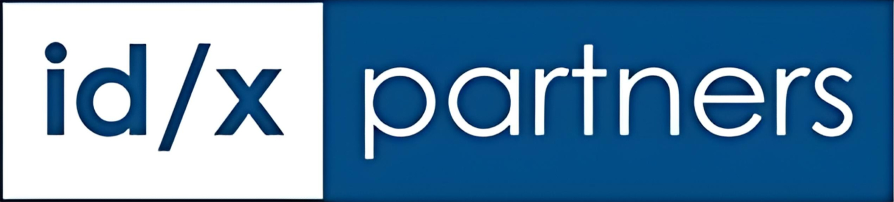
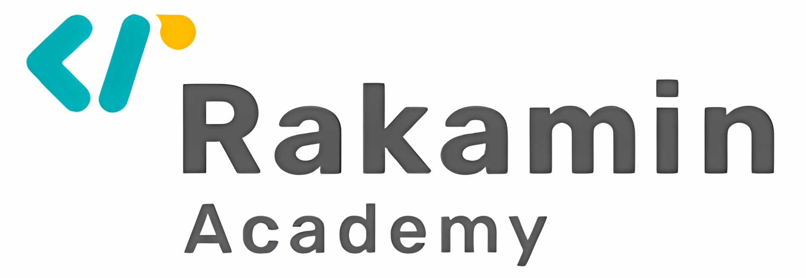
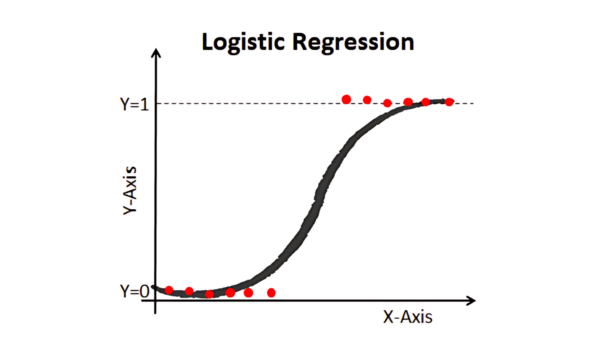
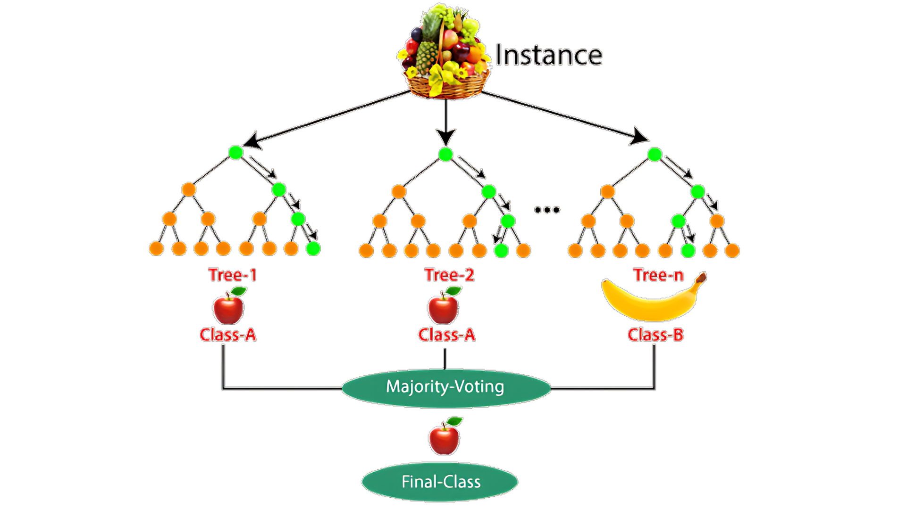
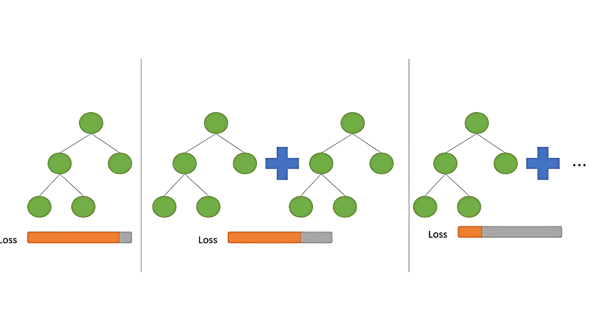

  

# PBI IDX Partners Data Science Final Task:  Develop a Classification Model to Predict Borrowers Creditworthiness

    
    
          

--------------------------

## 📚 Table of Contents
- [Introduction](#introduction)
- [Methodology](#methodology)
- [Results](#results)
- [Conclusion](#conclusion)
- [References](#references)

## 🚀 Introduction
This Project is a collaboration between IDX Partners and Rakamin Academy provided as a Project-Based Internship (PBI) for Data Science. The project obejctive aims to develop a classification model to predict borrowers' creditworthiness and the goals are to identify and help the company to reach the optimal business metrics that will be used to evaluate the model successfull to the company.

## 🔬 Methodology

  

This project follows the **CRISP-DM** methodology. Here's a breakdown of each step:

### 💡Business Understanding
--------------------------
The first step in the CRISP-DM process is to understand the business problem and objectives.
This business problem is the company suffer from 11.9% default rate that leads to pretty high loss due to default of 790K USD. The company wants to lower the default rate in order to lower the loss due to default and finally increasing the profit. Because of that the company needs a model that can predict the creditworthiness of the borrowers. The company wants to know which borrowers are likely to default on their loans so that they can be approved or denied accordingly.

### 📊 Data Understanding 
--------------------------
The data used in this project is a dataset from Lending Club `loan_data_2007_2014.csv` that given by Rakamin Academy and IDX Partners. 
Lending Club is a peer-to-peer lending company. The dataset contains information about loans issued from 2007 to 2014. 
The dataset contains 466285 rows and 75 columns, i classified the columns information into 5 Categories for better picture about the data:
- Borrowers' Loan Information (Loan Purpose, Loan Grade, etc.)

- Borrowers' Personal Information (Demographics, Employment, etc.)

- Borrowers' Financial Information (Income, Debt, etc.)

- Loan Information (Loan Amount, Interest Rate, etc.)

- Loan Status (Fully Paid, Charged Off, etc.)

### ️🛠 Data Preparation 
--------------------------
The Data Preprocessing steps taken are:
- Initial Feature Engineering (Feature creation, Feature Binning for Data Exploration purposes)

- Drop columns/features 
    - with more than 40% missing values
    - that are not useful for the model (High Cardinality, Low Variance)
    - and Columns that leak information about the target/label
    
- Train Test Split

- Impute missing values

- Feature Selection with Chi square test, ANOVA, and Multicollinearity

- Cap Outliers

- Further Feature Engineering:
    - Create New Features
    - Binning Features (Mapping Features)
    - Encode Categorical Features (Manual One Hot Encoding)

- Encode Categorical Features (One Hot Encoding)

- Scale Features (Standard Scaler)

- Handle Class Imbalance (SMOTE)

### 🤖 Modeling
--------------------------
The Machine Learning Algorithms used in this project and the reasons for choosing them are as follows:

1. Logistic Regression

    

 

[Source image: Data Camp](https://www.datacamp.com/tutorial/understanding-logistic-regression-python)

Logistic Regression is a simple and interpretable model that can be used as a baseline model. It is also useful for binary classification problems like predicting creditworthiness.

2. Random Forest

    

[Source Image: Analytics Vidhya](https://www.analyticsvidhya.com/blog/2021/06/understanding-random-forest/)

Random Forest is an ensemble learning method that can be used for classification and regression problems. It is a powerful model that can capture complex patterns in the data.

3. CatBoost

    

[Source Image: Medium by Okan Yenigün](https://python.plainenglish.io/smart-aspects-of-catboost-algorithm-2720a6de4da6)

CatBoost is a gradient boosting library that is designed for categorical features, this model is less prone to overfitting compared to other gradiet boosting models. This makes it a reliable choice for our project that this model have better performance than 2 other models that i choose.

All the three model trained with the default hyperparameters.

### 📈 Evaluation
--------------------------
The models were evaluated using the following metrics:
- AUROC (Area Under the Receiver Operating Characteristic Curve)
- F1 Score
- Precision
- Recall
- Confusion Matrix

The model evaluation results are as follows:

| Model                   | AUC_train | AUC_test | Recall_train | Recall_test | Precision_train | Precision_test | F1_train | F1_test | CrossVal_AUC |
|-------------------------|-----------|----------|--------------|-------------|-----------------|----------------|----------|---------|--------------|
| LogisticRegression      | 0.946672  | 0.935987 | 0.787541     | 0.760430    | 0.919578        | 0.602951       | 0.848453 | 0.672596| 0.934076     |
| RandomForestClassifier  | 0.988478  | 0.943958 | 0.908041     | 0.699682    | 0.982052        | 0.829845       | 0.943597 | 0.759225| 0.956271     |
| CatBoostClassifier      | 0.998837  | 0.982310 | 0.980092     | 0.840206    | 0.997623        | 0.964047       | 0.988780 | 0.897877| 0.983379     |

The CatBoost model has the highest AUC score, F1 score, and Recall score on the test set. It also has the highest precision score on the test set. This means that the CatBoost model is the best model for predicting creditworthiness.

###  🚀 Deployment
--------------------------
Deployment of the model are not done in this project, but the model can be deployed using Flask or FastAPI. 

## 🧮 Results
The results of the model from the prediction that i assume calculate the business impact are:
- Default Rate : 11.9% -> 2.5%
- Loss Due to Default : 790K USD -> 165K USD
- Total Profit : 5.8B USD -> 6.4B USD
- Net Profit : 5.8B USD -> 6.3B USD

The model has successfully reduced the default rate from 11.9% to 2.5%. This has led to a decrease in the loss due to default from 790K USD to 165K USD. The total profit has increased from 5.8B USD to 6.4B USD. The net profit has increased from 5.8B USD to 6.3B USD. This shows that the model has been successful in reducing the default rate and increasing the profit.

## 📝 Conclusion
In conclusion, the CatBoost model is the best model for predicting creditworthiness. The model has successfully reduced the default rate and increased the profit. The model can be deployed to predict the creditworthiness of borrowers and help the company make better lending decisions. The company can use the model to approve or deny loans based on the predicted creditworthiness of the borrowers. This will help the company reduce the default rate and increase the profit.

## 🌟 Acknowledgements
I would like to thank IDX Partners and Rakamin Academy for providing this project-based internship. I would also like to thank my mentor [Mr. Louis Madaerdo Sotrajua](https://www.linkedin.com/in/louismadaerdo/) for guiding me throughout the project.🙏
